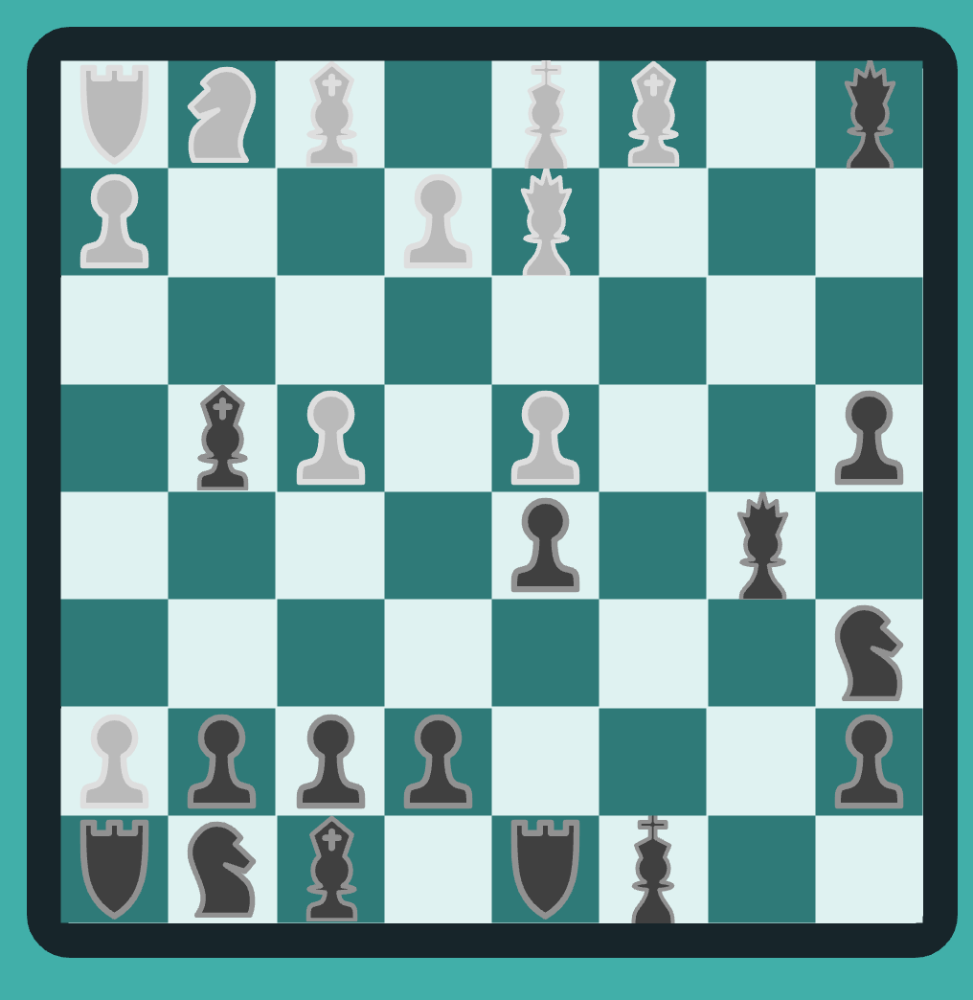

# Chess
An application for the game Chess.  Chess is a two-player strategy board game that is played on a 8 x 8 checker-patterned gameboard with 64 total squares.  A game played by millions of people worldwide.  In order for the application to work, you need to have two windows open.  One person should click on a color, and the other should click on the other color.  The application utilizes web sockets, so the two players can play with each other.

# Live Link
<a href="https://powerful-mountain-20313.herokuapp.com/gameBoard">LIVE LINK HERE</a>

# Repo Link
<a href="https://github.com/rockyboyyang/chess-server">Backend Repo</a>

# Technologies
- Front-end development
    - React
    - DOM manipulation
    - CSS
    - Websockets
    - HTML
    - JavaScript
    
 - Back-end development
    - Express
    - Morgan
    - Websockets
    - JavaScript

 # Features
 - Landing Page where two players can choose their color

 - Use websockets so two people can play at the same time

 - Having each of the individual pieces move how they should

 - Be able to implement unique moves (Castling and Promotions)
 - Castling

- Promotion

 - Able to play a full game of Chess

# Image of a game

# Technical Challenges
- Getting all the game pieces to move accordingly
- Using websockets to connect two UI's
- Getting all the game logic to correspond correctly

# Future Implementations
- En Pasantes
- Using databases to store users game stats
- Able to have more than one match happening at the same time
- Have a chat box next to the gameboard so the two players can chat
- Having sound and animations for the game pieces
